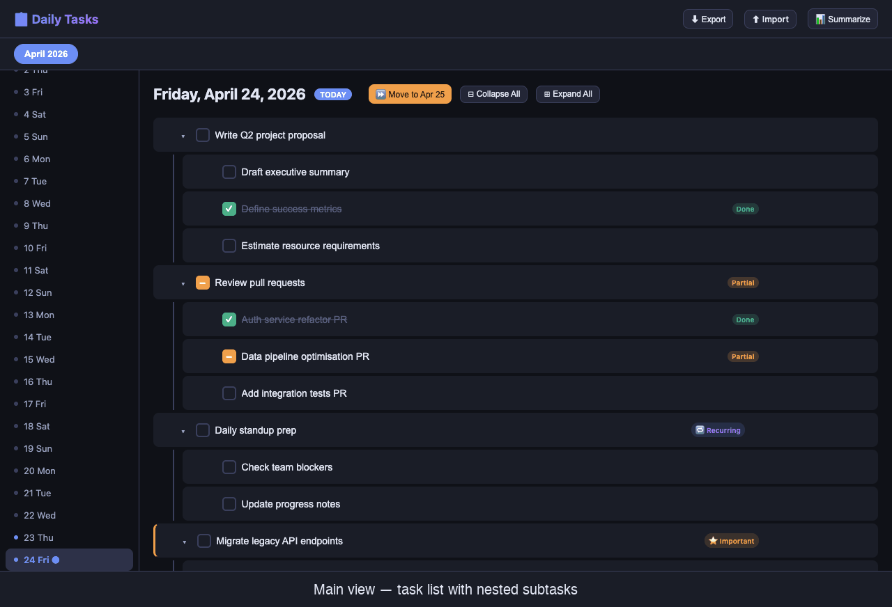
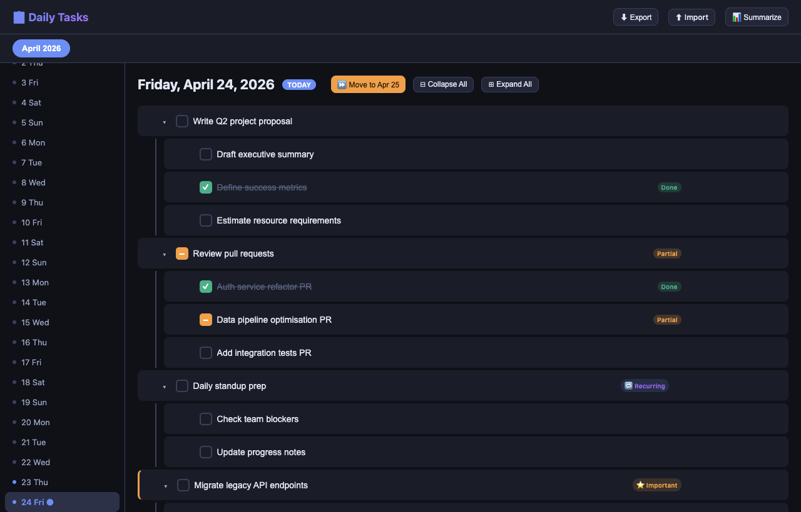
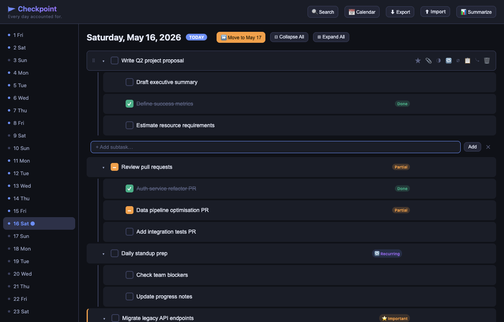
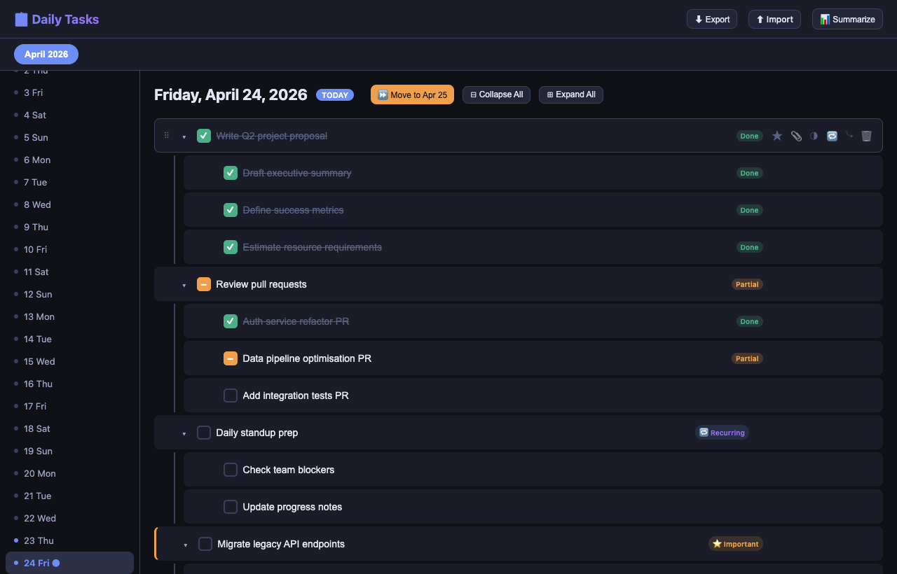
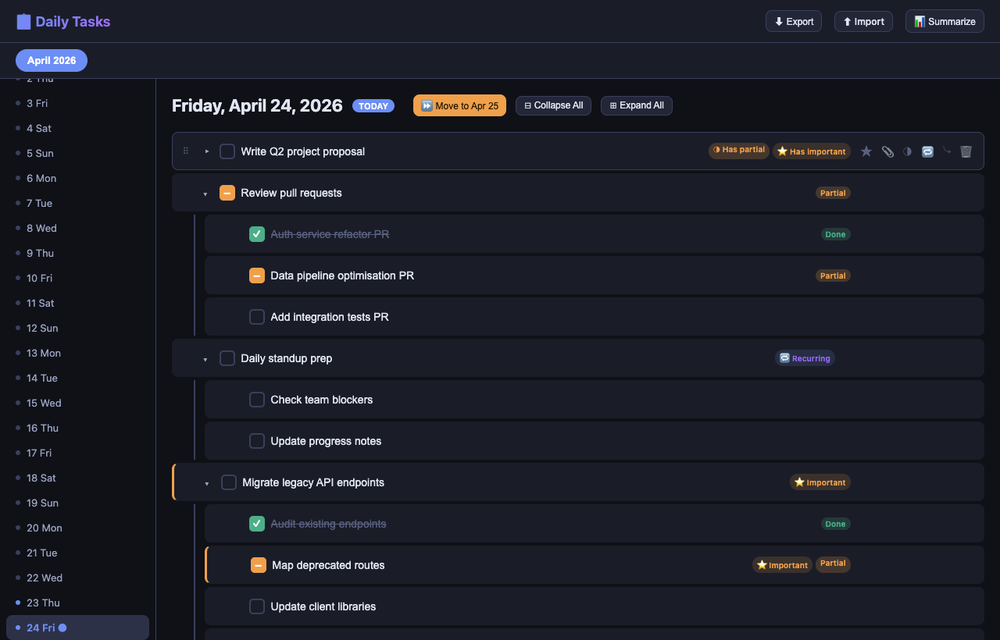
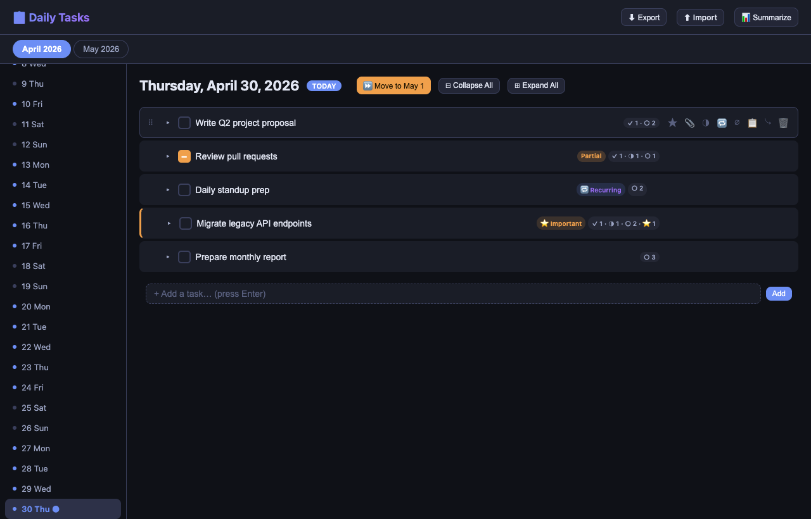
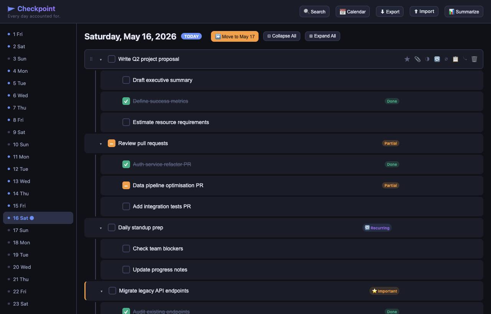
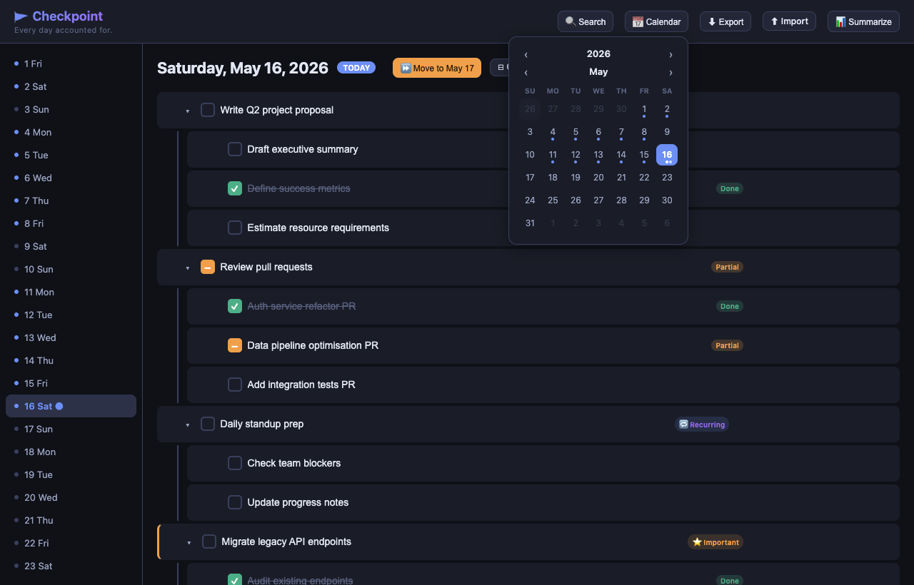
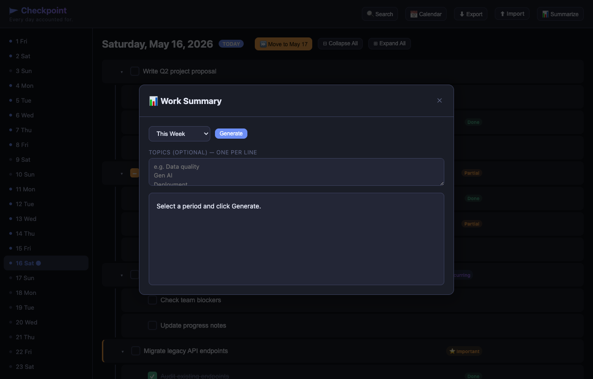
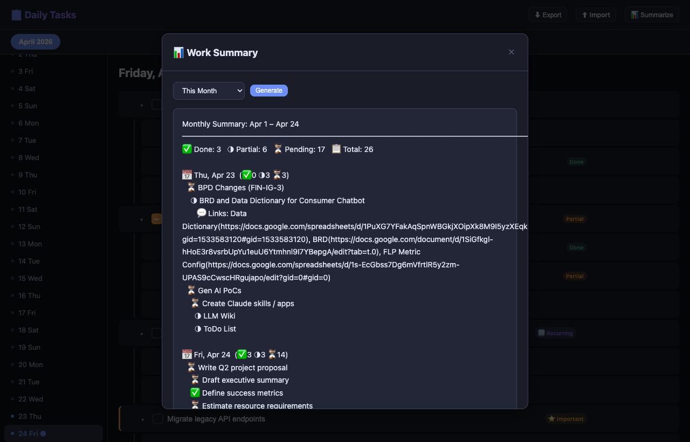

# Checkpoint

A personal daily task tracker with nested subtasks, rich context, recurring tasks, and work summaries. All data is stored as plain JSON files on your own disk — no cloud account, no database.



---

## Table of Contents

1. [What It Does](#what-it-does)
2. [Setup](#setup-terminal-version)
3. [Interface Overview](#interface-overview)
4. [Features](#features)
   - [Adding Tasks & Subtasks](#adding-tasks--subtasks)
   - [Task Status: Done / Partial / Pending](#task-status-done--partial--pending)
   - [Important Tasks](#important-tasks)
   - [Recurring Tasks](#recurring-tasks)
   - [Moving Tasks to the Next Day](#moving-tasks-to-the-next-day)
   - [Collapsing & Expanding Subtasks](#collapsing--expanding-subtasks)
   - [Drag and Drop Reordering](#drag-and-drop-reordering)
   - [Moving Subtasks Between Parents](#moving-subtasks-between-parents)
   - [Copying Tasks Between Days](#copying-tasks-between-days)
   - [Context: Notes, Links & Attachments](#context-notes-links--attachments)
   - [Calendar Picker](#calendar-picker)
   - [Searching Tasks](#searching-tasks)
   - [Excluding Tasks from Summaries](#excluding-tasks-from-summaries)
   - [Work Summary](#work-summary)
   - [Export & Import](#export--import)
5. [Data Storage](#data-storage)
6. [Project Structure](#project-structure)

---

## What It Does

Checkpoint helps you track what you work on each day. You can:

- Create tasks with unlimited nesting levels
- Mark tasks as done, partially done, or pending
- Flag important tasks and recurring tasks
- Roll incomplete tasks forward to the next day with a single click
- Attach notes, links (Jira, Slack, Google Docs/Sheets/Slides) and files to any task
- Browse tasks by month using the calendar picker
- Search across all tasks and notes instantly with keyboard navigation
- Generate summaries of work done over a week, month, quarter, or year

---

## How to Run

There are two ways to use Checkpoint:

### 1. macOS Standalone App (Recommended)
Launch from your Applications folder with a native window and dock icon.
- Download the latest **Checkpoint.app** from the [Releases](#) section.
- Drag it to your `/Applications` folder.
- Double-click to launch.
- **Data storage**: `~/Library/Application Support/Checkpoint/`

### 2. Terminal (For Developers)
Run via the command line using `uv`.
- Prerequisites: [uv](https://github.com/astral-sh/uv) and Python 3.11+
- Command: `uv run server.py`
- **Data storage**: `./data/` folder in the project directory.

---

## Setup (Terminal Version)

### Install uv (if not already installed)

```bash
curl -LsSf https://astral.sh/uv/install.sh | sh
```

```bash
git clone <your-repo-url>
cd todo-app
uv run server.py
```

The server will start and automatically open your default browser to `http://localhost:3456` (or the next available port).

**If port 3456 is already in use**, the server automatically picks the next available port and tells you:

```
  Port 3456 is in use — using port 3457 instead.

  Checkpoint is running!
  Open this URL in your browser:

      http://localhost:3457
```

Always use the URL printed in the terminal — it will always be correct.

#### Specify a port manually (optional)

```bash
uv run server.py --port 8080
# or
uv run server.py -p 8080
```

That's it. No `npm install`, no complex setup, no database. The `data/` folder is created automatically on first run.

### Configuring AI Summaries

The **📊 Summarize** feature uses an LLM to generate narrative summaries. Create a `.env` file in the `todo-app` directory with an API key for one of the supported providers. The first key found is used (priority order shown):

**Option 1 — Anthropic (default model: `claude-sonnet-4-6`)**
```
ANTHROPIC_API_KEY=sk-ant-...
```
Obtain a key at [console.anthropic.com](https://console.anthropic.com).

**Option 2 — OpenAI (default model: `gpt-4o`)**
```
OPENAI_API_KEY=sk-...
```
Obtain a key at [platform.openai.com](https://platform.openai.com).

**Option 3 — Google Gemini (default model: `gemini-2.5-flash`)**
```
GOOGLE_API_KEY=...
```
`GEMINI_API_KEY` is accepted as an alias. Obtain a key at [aistudio.google.com](https://aistudio.google.com).

**Overriding the model**

Set `SUMMARY_MODEL` to any model name supported by your chosen provider:
```
SUMMARY_MODEL=claude-opus-4-7
```

If no API key is configured, summary generation will return an error explaining what to set.

---

## Interface Overview




| Area | Purpose |
|---|---|
| **Header** | App title, Search tasks, open Calendar picker, Export/Import data, open Summarize modal |
| **Day sidebar** | All days of the active month; blue dot = has tasks; ● = today |
| **Task area** | Tasks for the selected day, action buttons in the header row |
| **Context panel** | Slides in from the right when you click 📎 on a task |

---

## Features

### Adding Tasks & Subtasks


**Add a top-level task:**
- Type in the `+ Add a task…` input at the bottom and press **Enter** or click **Add**

**Add a subtask:**



- Hover over any task row to reveal action buttons
- Click **⤷** to open a subtask input directly below that task
- Press **Enter** to save, **Esc** to cancel
- Or press **Enter** while the task text field is focused — this also opens the subtask input

Tasks can be nested to any depth. Each level is indented with a vertical guide line.

---

### Task Status: Done / Partial / Pending



Every task has one of three statuses, shown with a badge and a left border:

| Status | How to set | Badge |
|---|---|---|
| **Pending** | Default state | (none) |
| **Done** | Click the checkbox ✓ | `Done` (green) |
| **Partial** | Hover → click **◑** button | `Partial` (amber) |

**Marking a task done cascades to all subtasks** — every descendant is marked done automatically.

**Parent indicators when collapsed:** a subtask count badge shows `✓ done · ◑ partial · ○ incomplete · ⭐ important` counts for the **leaf-level** subtasks only (only non-zero values shown). See [Collapsing & Expanding Subtasks](#collapsing--expanding-subtasks) for details.

---

### Important Tasks

Mark any task as important by hovering the row and clicking the **★** button.

| State | Visual |
|---|---|
| Important | ★ button turns amber, `⭐ Important` badge appears, amber left border on the row |
| Not important | ★ button is grey, no badge |

When collapsed, a parent task shows `⭐ Has important` if any descendant is marked important.

---

### Recurring Tasks


A recurring task automatically rolls forward to the next day every time you move tasks — even if it was marked done. It keeps repeating until you explicitly close it.

**To make a task recurring:** hover the row → click **🔁**
- The button turns blue and a `🔁 Recurring` badge appears

**To stop recurrence:** click the **⏹** button that appears next to 🔁
- The badge changes to `⏹ Closed` and the task stops rolling forward

**Behaviour on move:**
- A fresh pending copy is created on the next day regardless of the current status
- The original (possibly done) copy is kept on the current day as a record

---

### Moving Tasks to the Next Day


Click **⏩ Move to [next date]** in the day header to roll incomplete work forward.

The rules applied to each task:

| Task state | Current day | Next day |
|---|---|---|
| **Done** (non-recurring, no recurring descendants) | Kept as-is | Nothing moved |
| **Partial** (leaf task) | Kept as record | Copy moved forward |
| **Pending** (leaf task) | Removed | Moved forward |
| **Mixed subtasks** | Record kept with done/partial/recurring subtasks | Copy with pending/partial/recurring subtasks (recurring reset to pending) |
| **Recurring** (any status, not closed) | Kept as-is | Fresh pending copy always created |
| **Recurring subtask** (any status, not closed) | Kept in current-day record | Included in next-day copy, reset to pending |

Recurring tasks and subtasks are **always forwarded** — even when marked done — so they keep rolling forward every day until explicitly closed. The current day always retains a record of what was done, so no work is silently dropped.

**Duplicate prevention:** tasks are matched by text when merging into the next day. If a task with the same text already exists at the same level on the next day, its children are merged in rather than creating a second copy. This means:
- Clicking **Move** multiple times is safe — tasks won't pile up on the next day.
- If the same subtask name appears under two different parent tasks and one parent is already on the next day, only the already-present subtask is skipped — the other parent and its subtask are moved across correctly.

---

### Collapsing & Expanding Subtasks



Any task with subtasks shows a **▾ chevron** to the left of its checkbox.

| Action | How |
|---|---|
| Collapse one task | Click **▾** on that task (chevron rotates to indicate collapsed) |
| Expand one task | Click the rotated chevron again |
| Collapse all tasks | Click **⊟ Collapse All** in the day header |
| Expand all tasks | Click **⊞ Expand All** in the day header |



While collapsed, the parent row shows a subtask count badge summarising the **leaf-level** subtasks:

| Symbol | Meaning |
|---|---|
| ✓ N | N leaf subtasks marked **done** |
| ◑ N | N leaf subtasks marked **partial** |
| ○ N | N leaf subtasks **incomplete** (pending) |
| ⭐ N | N leaf subtasks marked **important** |

Only non-zero counts are shown, so a task with 2 done leaves and 1 incomplete leaf displays `✓ 2 · ○ 1`.

**Leaf-level counting:** only the deepest subtasks in each branch are counted. If a subtask has children of its own, the subtask itself is not counted — its children are. For example, a task with two subtasks where one subtask has two children of its own shows a total count of 3 (the childless subtask + the two grandchildren), not 4.

---

### Drag and Drop Reordering

Hover any task row to reveal the **⠿ drag handle** on the left. Drag it to reorder tasks.

**Drop zones** (determined by where your cursor is within the target row):

| Cursor position | Effect |
|---|---|
| Top 30% of row | Insert **before** the target |
| Bottom 30% of row | Insert **after** the target |
| Middle 40% of row | Make the dragged task a **child** of the target (shown with dashed purple outline and `↳ drop as child` hint) |

Reordering works at every nesting level. The "drop as child" zone lets you nest a task under a different parent in one drag.

---

### Moving Subtasks Between Parents

Using the same drag-and-drop system, you can move a subtask to a completely different parent:

1. Grab the **⠿** handle on a subtask
2. Drag it over any other task
3. Drop on the **middle zone** (dashed outline) to make it a child of that task
4. Or drop on the **top/bottom edge** to place it as a sibling at the target's level

You can also **promote** a subtask to a top-level task by dropping it on the top or bottom edge of a top-level task.

---

### Copying Tasks Between Days

Any task (including all its subtasks) can be copied to the clipboard and pasted into any other day.

**To copy a task:**
- Hover the task row and click **📋** — the task and its entire subtask hierarchy are copied to the clipboard

**To paste:**
- Navigate to the destination day
- Click **📋 Paste "[task name]"** in the day header

**Behaviour:**
- All statuses (done/partial) are reset to **pending** on paste — you're copying the structure, not the completion state
- Pasting the same task onto a day that already has a task with the same text will **merge** rather than duplicate — existing subtasks are preserved and only missing subtasks are added
- The clipboard persists while navigating between days and months, so you can copy from one day and paste into any other

---

### Context: Notes, Links & Attachments



Every task has a context panel for capturing supporting information. Open it by hovering the row and clicking **📎** (or clicking the `📎 Context` badge).

**Context preview on hover:** when a task has context, hovering over the `📎 Context` badge shows a tooltip preview of its contents — notes (up to 3), links with their type icons and labels (up to 4), and attachments (up to 3). If there are more items than shown, a "+N more…" indicator appears. This lets you glance at context without opening the full panel. Click the badge to open the full panel for editing.

The panel slides in from the right and shows:

#### Notes
Free-form text notes. Click **+ Add Note** to create one. Notes auto-save on blur. Click **Delete** to remove a note.

#### Links
Attach URLs categorised by type:

| Type | Icon |
|---|---|
| Jira | 🔵 |
| Slack | 💬 |
| Google Docs | 📄 |
| Google Sheets | 📊 |
| Google Slides | 📽️ |
| GitHub | 🐙 |
| Other | 🔗 |

Click **+ Add Link**, select the type, enter an optional label and the URL, then click **Save**.

To **edit an existing link**, hover the link card and click **✏️** — an inline form opens pre-filled with the current type, label, and URL. Make changes and click **Save**, or **Cancel** to discard.

To **delete a link**, click **🗑** on the link card.

#### Attachments
Click **📎 Attach File** to attach one or more files. File name and size are recorded. The `📎 Context` badge appears on the task row whenever any context exists.

Context (notes, links, attachments) is included in work summaries.

---

### Calendar Picker



Click **📅 Calendar** in the header to open the calendar popover.

The popover shows a full month grid (Sunday–Saturday) with independent year and month navigation:

| Control | Action |
|---|---|
| **‹ / ›** next to the year | Step back or forward one year |
| **‹ / ›** next to the month | Step back or forward one month |
| Click a day | Jump to that day — switches month in the sidebar if needed |
| Click outside | Close the popover |

**Day indicators in the grid:**
- Blue dot below the number — day has tasks
- Blue highlighted number + underline dot — today
- Filled blue cell — currently selected day
- Faded number — day belongs to the previous or next month (still clickable)

Navigating to a month with no data still shows the full grid — all days are clickable and the sidebar updates to show that month's days.

---

### Searching Tasks

Click **🔍 Search** in the header (or press **⌘K** / **Ctrl+K**) to open the search panel.

**What it searches:**
- Task and subtask text across **all months**
- Note content in task context panels

**Results show:**
- The matched task text with the matching portion highlighted
- Breadcrumb path for subtasks (e.g. `Parent task › Subtask`)
- The date the task belongs to
- Status and flag badges (Done, Partial, Important, Recurring)
- A note indicating when the match was found in a note rather than the task name

**Navigating results:**

| Action | How |
|---|---|
| Move between results | **↑ / ↓** arrow keys |
| Jump to a result | **Enter** or click the result row |
| Close search | **Esc** or click outside the panel |

**Jumping to a result** navigates to the correct month and day, expands any collapsed ancestor tasks, scrolls the matching task into view, and briefly highlights it in blue.

Search loads all months on first open so results are complete regardless of which month is currently active.

---

### Excluding Tasks from Summaries

By default every task and subtask is included in work summaries. You can exclude individual tasks or entire subtask hierarchies when they aren't relevant to a summary (e.g. admin tasks, recurring housekeeping items).

**To exclude a task:** hover the task row and click **∅** — the button dims and an **∅ Excluded** badge appears on the task row.

**To re-include a task:** hover the row and click **∅** again — the badge disappears and the task is included in future summaries.

**Behaviour:**
- Excluding a task also excludes **all of its subtasks** — the entire branch is skipped in summary generation
- The excluded state is saved to disk and persists across sessions
- Excluded tasks still appear and function normally in the task list; only summary generation is affected
- The `∅ Excluded` badge is visible at a glance without hovering

---

### Work Summary





Click **📊 Summarize** in the header to open the summary modal. The summary is generated by an AI model (Claude via Anthropic API — see [Configuring AI Summaries](#configuring-ai-summaries)).

**Period options:**

| Period | Coverage |
|---|---|
| This Week | Monday → today |
| This Month | 1st of month → today |
| This Quarter | Start of current quarter → today |
| This Year | Jan 1 → today |
| Custom Range | Any date range you choose |

**Topics (optional):** Enter one topic per line to focus the summary on specific areas (e.g. "Data quality", "Gen AI", "Deployments"). The model will write a dedicated paragraph for each topic. If there is insufficient information in your tasks to address a topic, it will say so explicitly rather than guessing.

If no topics are provided, the model groups your work logically by project or theme and writes one paragraph per group.

Click **Generate** to produce the summary. The AI:
- Reads all tasks, subtasks, notes, and link labels for the selected period
- Focuses on what was **actually accomplished** — done and partial work
- Uses the specific task names and context details — avoids vague generalisations
- Never invents or infers details not present in your task data
- Appends a stat line: `Period: … · ✓ N done · ◑ N partial · ○ N pending`

Tasks marked **∅ Excluded** (see [Excluding Tasks from Summaries](#excluding-tasks-from-summaries)) are skipped entirely.

The generated summary is cleared automatically when you close the modal, so each time you open it you start fresh.

This makes it easy to write status updates, retrospectives, or performance reviews.

---

### Export & Import

**Export:** Click **⬇ Export** to download all your task data as a single JSON file (`tasks-backup-YYYY-MM-DD.json`). Use this as a backup or to move data between machines.

**Import:** Click **⬆ Import**, select a previously exported JSON file. The data is merged into your current data and saved to disk.

---

## Development & Rebuilding

If you modify the source code (e.g., `index.html` or `server.py`) and want to see those changes in the macOS app, you need to rebuild the bundle.

### Rebuilding the macOS App
We provide an automation script that handles the environment setup and bundling:
```bash
./build.sh
```
This script will:
1. Create/update a dedicated build virtual environment (`.venv_build`).
2. Install all necessary dependencies (`pyinstaller`, `pywebview`, etc.).
3. Generate the native macOS icons from `app_icon.png`.
4. Bundle everything into `dist/Checkpoint.app`.

> [!NOTE]
> **Troubleshooting:** If the build fails during the cleanup phase with an `rm: dist: Directory not empty` error, it is typically because macOS (or Finder) is actively accessing a hidden file like `.DS_Store` inside the directory while it's being deleted. You can bypass this by manually forcefully removing the directory first:
> ```bash
> rm -rf dist && ./build.sh
> ```

### Testing Changes
For faster development cycles, it is recommended to test your changes using the terminal version first:
```bash
uv run server.py
```
Once you are satisfied with the changes, run `./build.sh` to update your standalone app. The build process uses `app_icon.png` (a premium, transparent source image) to generate the high-resolution native icons.

---

## Data Storage

Depending on how you run the application, each month's tasks are stored in a separate JSON file:

- **macOS Standalone App:** Stored under the system Application Support directory:
  ```
  ~/Library/Application Support/Checkpoint/
  ├── 2026-05.json
  ├── 2026-06.json
  └── ...
  ```
- **Terminal/Developer Mode:** Stored locally under the project directory:
  ```
  todo-app/
  └── data/
      ├── 2026-05.json
      ├── 2026-06.json
      └── ...
  ```

Each file contains a map of date strings to day objects:

```json
{
  "2026-04-24": {
    "tasks": [
      {
        "id": "abc123",
        "text": "My task",
        "status": "pending",
        "important": false,
        "recurring": false,
        "closed": false,
        "children": [],
        "context": {
          "notes": [],
          "links": [],
          "attachments": []
        }
      }
    ]
  }
}
```

The `data/` directory is excluded from git (via `.gitignore`), so your personal tasks are never committed. Each person who clones the repo starts with a blank slate.

---

## Project Structure

```
todo-app/
├── index.html       # The entire front-end — one self-contained HTML file
├── server.py        # Minimal Python HTTP server (no dependencies)
├── .gitignore       # Excludes data/ and other non-source files
├── README.md        # This file
├── data.sample.json # Structural template for task data
└── data/            # Auto-created on first run; gitignored
    └── YYYY-MM.json # One file per month
```

### Source Files (Tracked in Git)
These are the files you receive when you first clone the repository:

- `index.html` — The entire front-end (HTML/JS/CSS).
- `server.py` — The Python backend for data storage and AI summaries.
- `launcher.py` — The entry point for the bundled macOS application.
- `build.sh` — Main automation script for rebuilding the `.app` bundle.
- `setup_app.py` — Configuration script used by the build process.
- `app_icon.png` — Premium transparent source image for the app icon.
- `data.sample.json` — A clean, structural sample of the task data JSON format.
- `README.md` — This documentation.
- `docs/` — Screenshots and documentation assets.

### Generated Files (Ignored by Git)
You will see these files and folders appear based on your actions:

| Action | Created Files/Folders | Purpose |
| :--- | :--- | :--- |
| **Running the app** | `data/` | Stores your local task JSON files. |
| **Configuring AI** | `.env` | Stores your private API keys (create this manually). |
| **Running `./build.sh`** | `.venv_build/` | Isolated environment for build tools. |
| | `build/` & `dist/` | Temporary build files and final `.app` bundle. |
| | `icon.icns` & `*.spec` | Generated icon bundle and build specifications. |
| **Running tests** | `.pytest_cache/` | Cache to speed up subsequent test runs. |

**`server.py`** handles the following routes:

| Method | Path | Purpose |
|---|---|---|
| `GET` | `/` | Serve `index.html` |
| `GET` | `/months` | List months that have data files |
| `GET` | `/data/YYYY-MM` | Load a month's task data |
| `PUT` | `/data/YYYY-MM` | Save a month's task data |
| `POST` | `/summarize` | Generate an AI summary for a date range |

**`index.html`** contains all JavaScript and CSS inline — no build tools, no npm, no bundler required.

---

## Keyboard Shortcuts

| Key | Action |
|---|---|
| `⌘K` / `Ctrl+K` | Open / close search |
| `↑` / `↓` (in search) | Navigate results |
| `Enter` (in search) | Jump to selected result |
| `Esc` (in search) | Close search |
| `Enter` (in task input) | Save task / add another |
| `Enter` (in task text field) | Open subtask input below |
| `Esc` (in subtask input) | Close subtask input |

---

## Tips

- **Daily workflow:** At the end of each day click **⏩ Move to [tomorrow]** to carry forward any incomplete work. Partial tasks leave a record behind so you never lose track of what was started.
- **Recurring checklist items** (e.g. daily standup, DQ checks): Mark them 🔁 Recurring and they roll forward automatically every day until closed.
- **End-of-week/month summaries:** Use 📊 Summarize → "This Week" or "This Month" to quickly compile what was accomplished, including any Jira/Slack/Doc links you attached.
- **Backup regularly:** Use ⬇ Export to save a JSON snapshot. You can re-import it at any time.

---

## Security Notes

- `.env` is gitignored — credentials are never committed
- `data/` is gitignored — task data stays local
